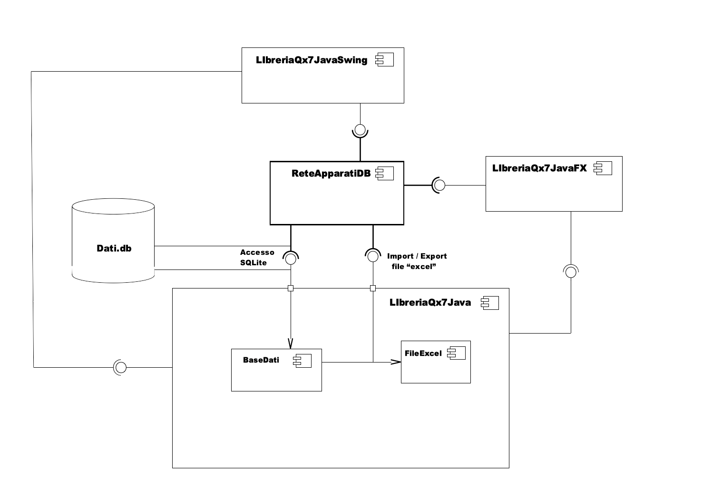

# ReteApparatiDB
Programma di interfaccia <b>JavaFX</b> di una base di dati <b>SQLite</b> per la gestione degli apparati di una rete locale.
Il programma è sviluppato tramite l' IDE <b>NetBeans</b>.

